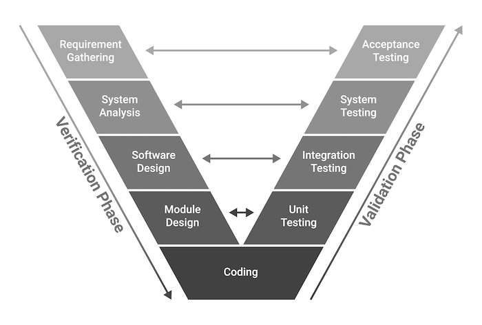

# Cloud Manager Testing Strategy

### Overview

This testing strategy document outlines the testing activities for the Cloud Manager Kyma component. It is meant to be a guide for all specific testing-related processes. The document details the approaches, processes, and methodologies used to prioritise testing throughout the software development life-cycle.

The testing strategy aims to achieve the following quality characteristics for the Cloud Manager component:

* `Functional Completeness` and `Functional Correctness` by integrating validation activities into the feature acceptance process.
* `Backward Compatibility` through regression testing and requirements management guidelines.
* `Reliability` (with a focus on faultlessness and availability) using operational awareness logging, alerting mechanisms, and robustness system test suites.
* `Performance Efficiency` by verifying the product against time-behavior and resource utilization test suites.
* `Maintainability` by collecting and analyzing code quality metrics such as reusability, modularity, and software package quality.

This document is refined by Test Plan documents, which define the testing approach for each particular testing activity.

### Out of Scope Quality Characteristics

This list of quality characteristics has not yet been defined as part of the testing strategy for the current iteration. It is yet to be refined in collaboration with respective stakeholders.

| Quality Characteristic | Description                                                  | Justification                                                |
| ---------------------- | ------------------------------------------------------------ | ------------------------------------------------------------ |
| Compatibility          | Degree to which a product, system or component can exchange information with other products, systems or components, and/or perform its required functions while sharing the same common environment and resources. | To define a comprehensive set of compatibility requirements, we need a centralised systems engineering approach and guidelines for the interconnection and integration of Kyma components. |
| Interaction Capability | Degree to which a product or system can be interacted with by specified users to exchange information ia the user interfaceto complete specific tasks in a variety of contexts of use. | We need to create a centralised Kyma user guide focused on user-friendliness and user engagement first. |
| Security               | Degree to which a product or system defends against attack patterns by malicious actos and protects information and data so that persons or other products or systems have the degree of data access appropriate to their types and levels of authorisation. | We need a stakeholder to define the security expectations and to provide the testing scenarios for the different security aspects. |
| Flexibility            | Degree to which a product can be adapted to changes in its requirements, contexts of use or system environment. This characteristic is composed of the adaptability, scalability and installability. | These quality characteristics are the higher-level test suites compared to the performance efficiency ones and will be added gradually. |

### Testing Levels

By differentiating between [validation and veirfication](https://en.wikipedia.org/wiki/Verification_and_validation) activities and utilizing the [V-model](https://en.wikipedia.org/wiki/V-model) as a software development lifecycle, we categorise all test suites into distinct testing layers with corresponding testing activities for each.

| Testing Level | Purpose                                                      |
| ------------- | ------------------------------------------------------------ |
| Acceptance    | The highest level of validation ensures that the component conforms to the functional requirements. |
| System        | The end-to-end testing, utilizing test doubles when possible, to test the correctness of the system as a whole. |
| Integration   | The low-level testing is meant to check how different components work together on an integration level, focusing on one integration aspect at a time. |
| Unit          | The low-level development-oriented testing that aims to enhance the maintainability characteristics of the system. |

### Test Approaches and Practices

The `Manual Testing` practice should be minimized and automated as much as possible.

[`Exploratory Testing`](https://en.wikipedia.org/wiki/Exploratory_testing) is not relevant due to the newness of the component.

The main testing practices include `Automated Testing` combined with [`Experience-Based Testing`](https://testsigma.com/blog/experience-based-testing/), discouraging exhaustive testing approaches as ineffective for the project scope.

The project clearly distinguishes between `Functional Testing` and `Non-Functional Testing` by incorporating all functional testing into the validation phase, which exclusively focuses on functional correctness and completeness. It also includes some lower-level integration and unit test suites, which indirectly contribute to functional correctness. The non-functional tests provide quality measures for specific criteria that can be used to assess the operation of a system, focusing on factors such as performance and reliability.

### Test Plan

A test plan is a document outlining the objectives, resources, and procedures for a specific testing session for a software or hardware product. This testing strategy defines the general approach, which is then detailed in specific test plan documents. Each test plan outlines the testing approach for a particular aspect of testing. Due to the Agile nature of the SDLC, all testing activities occur automatically for each CI/CD cycle. This means that the test plans define the automated strategy for verifying specific aspects in a repetitive manner.

### Appendix A. Quality Evidence Registry

| Artefact Links                 | Aspect                                                       | Test Plan Document        |
| ------------------------------ | ------------------------------------------------------------ | ------------------------- |
| Feature validation report      | Functional correctness and completeness                      | Validation test plan      |
| System integration test report | System analysis and software design                          |                           |
| Integration test report        | Testing the interconnection of the <...> components          |                           |
| Code coverage report           | Unit tests (Ravi, Amir to follow-up)                         | Unit testing test plan    |
| Code coupling report           | Codebase mainatainability                                    | Maintainability test plan |
| Availability report            | Faultlessness                                                |                           |
| CI/CD pipeline                 | The list of all the test suites executed for the feature integration |                           |
| Performance testing report     |                                                              | Performance test plan     |

### Appendix B. Team Processes and Guidelines

| Artefact              | Description                                              |
| --------------------- | -------------------------------------------------------- |
| Code review guideline | The Code of Conduct for the Code Review activities.      |
| Codestyle guideline   | The Code of Conduct for the coding codestyle agreements. |
|                       |                                                          |

